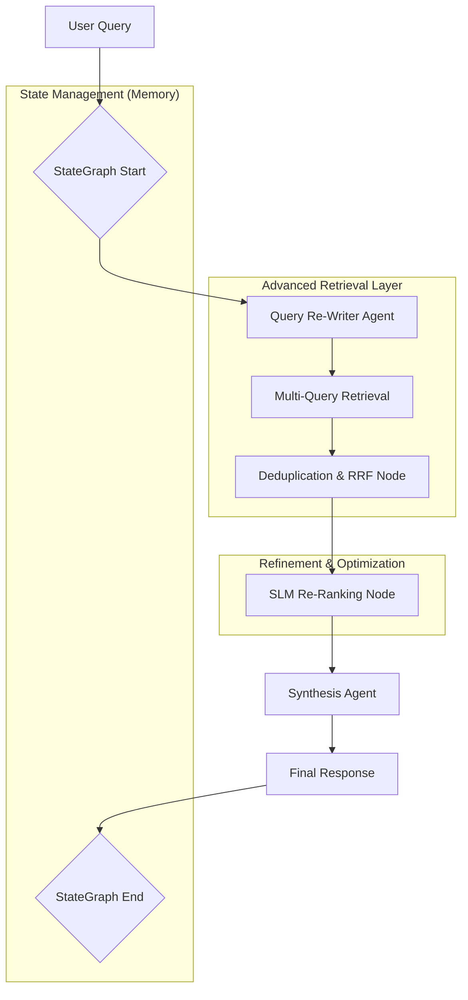

**State-of-the-Art RAG v2.0 Architecture**

This architecture is managed via a LangChain ChainOfThought, ensuring that every step of the process is recorded in a shared, persistent state using      
TypedDict and operator.add reducers to prevent context overwriting.

### The Architectural Flow

